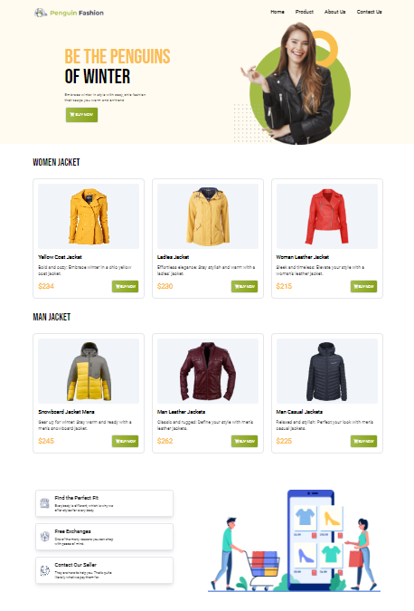

<h1>Welcome To My Tailwind Project!</h1>

This is a e-commerce landing page named Penguin Fashion. I will explore tailwind css in this project.

<h4>Technologies:</h4>
<ul>
<li>Tailwind CSS</li>
<li>Basic HTML & CSS</li>
</ul>

<h4>Resources:</h4>
<ul>
<li>Google fonts</li>
<li>Font Awesome</li>
</ul>

<h3>Output</h3>

